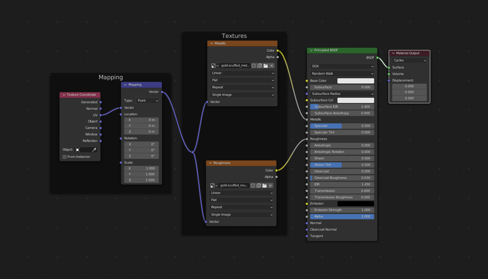
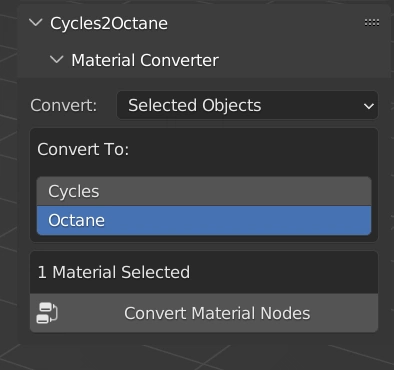

# Cycles2Octane Material Converter

## Overview

Convert Cycles Materials to Octane Materials in Blender with a single click.

## Features

- **Single Click Conversion**: Convert Cycles materials to Octane materials with a single click.
- **Reverse Conversion**: Convert Octane materials back to Cycles materials.
- **Support for Blender 3.3**: Fully compatible with Blender 3.3 and earlier versions.

## Installation

1. Download the addon from the [releases page](#).
2. Open Blender and go to `Edit > Preferences`.
3. Select `Add-ons` and click `Install`.
4. Choose the downloaded `.zip` file and click `Install Add-on`.
5. Enable the addon by checking the box next to `Cycles2Octane`.

## Usage

1. Go to the add-on panel located in the `Octane` tab.
2. Select the conversion method.
3. Click the `Convert Material Nodes` button.

## License

This project is licensed under the GPL v3 License - see the [LICENSE](LICENSE) file for details.